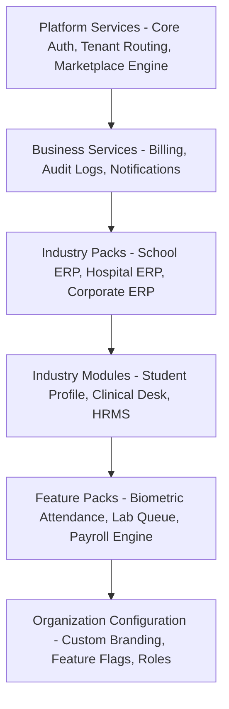

# AURXON Platform OS - Master Product Bible

## 1. Vision & Mission

### 1.1 The Vision
AURXON is the **Operating System for Modern Enterprises and Institutions**. It is a single, centralized, multi-tenant SaaS ecosystem designed to handle complex organizational workflows with the simplicity of a consumer application. Instead of fragmented software suites, AURXON provides a unified core platform that scales dynamically across different industries (Education, Healthcare, Corporate) through hot-swappable Industry Packs, modular configurations, and role-specific user experiences.

### 1.2 The Mission
To democratize enterprise-grade operational software by providing businesses and institutions of all sizes with a secure, highly performant, visually elite, and instantly deployable SaaS workspace. We eliminate the friction of onboarding and system customization, allowing organizations to transition from registration to live operations in minutes.

---

## 2. Core Principles

1. **Product, Not Modules**: Every feature must feel like a natural extension of the single, unified AURXON core. We build cohesive workflows rather than isolated feature checkboxes.
2. **Zero UI/UX Friction**: User interfaces must be modern, minimal, premium, and responsive. We enforce a zero-flash authentication policy, contextual loading skeletons, and strict separation between roles to protect privacy.
3. **Multi-Tenant Isolation**: Tenant isolation must be strictly enforced at the data layer, the routing layer, and the application API layer.
4. **Adaptive Customization**: The platform scales by configuration, not code duplication. Industry variations are handled through metadata-driven templates, dynamic layout rendering, and feature flags.
5. **Architectural Discipline**: Platform services must remain centralized. Common functionality stays in the core, while industry packs extend it cleanly without cross-leakage.

---

## 3. Platform Layers

The architecture of AURXON is divided into five logical layers:

1. **Platform Services (Core)**: Shared infrastructure including authentication (zero-flash context engine), session management, tenant context resolution, database connection pooling, and the main request router.
2. **Business Services (Common)**: Shared business logic used across multiple industries, such as subscription limits, billing/invoices, audit logs, and notification dispatchers.
3. **Industry Packs**: Specialized packages defined by a set of modules (e.g. `SCHOOL_ERP`, `HOSPITAL_ERP`, `CORPORATE_ERP`). They define the workspace identity and feature limits.
4. **Industry Modules & Feature Packs**: Specialized functional items (e.g. `STUDENT_MANAGEMENT`, `APPOINTMENTS`, `HRMS`) that are activated dynamically based on tenant licensing.
5. **Organization Configuration**: Tenant-specific branding parameters (primary color, logo, slug, workspace name) and granular feature flags.

---

## 4. Industry Strategy & Marketplace Philosophy

### 4.1 Industry Strategy
Rather than maintaining separate codebases for different verticals, AURXON maintains a **Unified Core** and deploys industry features as isolated packs. 
* A **School** tenant sees student directories, attendance matrices, fee receipts, and gradebooks.
* A **Hospital** tenant sees patients, doctors, appointment slots, and lab reports.
* A **Corporate** tenant sees employees, teams, project boards, and payrolls.

No database fields or API routes belonging to one industry must leak to another.

### 4.2 Marketplace Philosophy
The AURXON Marketplace is the commercial gateway for SaaS upsells:
* **Choose Industry**: Selects the primary Industry Pack (`SCHOOL_ERP`, `HOSPITAL_ERP`, `CORPORATE_ERP`).
* **Choose Modules**: Fine-tune the activated features (e.g. enable Biometric Attendance for School ERP).
* **Review Pricing**: Standardizes pricing based on active modules and usage limits.
* **Tenant Validation**: Automated or manual approval of registration, followed by secure token activation.

---

## 5. Design Language & Dashboard Standards

### 5.1 Design Language
AURXON uses a premium, modern design system:
* **Typography**: Elegant modern typography (using Inter/Outfit fonts) with a strict heading hierarchy.
* **Harmonious Palette**: Sleek dark modes and light modes using HSL variables. Pure whites, rich slates, and clean indigos replace basic generic colors.
* **Zero Flicker**: Background sync is deferred until authentication state is resolved. A clean full-screen loading skeleton covers context resolution.
* **Component Standards**: Interactive states must feature subtle hover transitions and micro-animations. Form validation errors must be inline, and dialogs must contain clear actions.

### 5.2 Empty States
Tables, lists, and pages with no records must never display empty white space. They must always show:
1. An elegant illustrative empty state icon.
2. A clear message (e.g. "No Students Found").
3. A primary quick action button (e.g. "Import Students" or "Create Student").
4. A secondary learning link (e.g. "Learn More").

---

## 6. Development & Coding Rules

### 6.1 Naming Standards
* **Database Tables/Models**: PascalCase, singular (e.g. `Student`, `Institution`, `AuditLog`) mapped to the Prisma schema.
* **API Endpoints**: Plural nouns, kebab-case (e.g. `/api/student-profiles` or `/api/receipts`).
* **Directories/Folders**: Numeric prefixes for layer representation (e.g. `01_Core`, `02_Admission`, `03_Attendance`, `09_Reports`).
* **UI Components**: PascalCase, descriptive names (e.g. `WorkspaceHeader.tsx`, `ReportsDashboard.tsx`).

### 6.2 Module & Feature Rules
* **No Logic Duplication**: Business rules (e.g. checking whether a role is authorized) must be implemented in NestJS guards and Shared Services, never duplicated in client-side code alone.
* **Gated API Execution**: Every controller route must use `@UseGuards(JwtAuthGuard, ModuleActiveGuard)` to verify that the active tenant has purchased the target module.
* **Support Access Impersonation**: Founder/Super Admin accounts must not access tenant database rows directly. They must launch an Audit-Logged Impersonation Session with a valid ticket ID and duration.

---

## 7. Future Roadmap

1. **Workspace Lifecycle Engine (Phase 3)**: Fully automated tenant database partitioning and offline synchronization.
2. **AI Analytics Assistant**: Embedded query interface for organization principals and corporate managers to run natural language reports.
3. **Global Edge Cache**: Move tenant metadata and context resolution to Cloudflare Workers to drop page shell TTFB to <30ms.
4. **Enhanced Mobile Native Experience**: Responsive web view optimization with service worker offline support.
