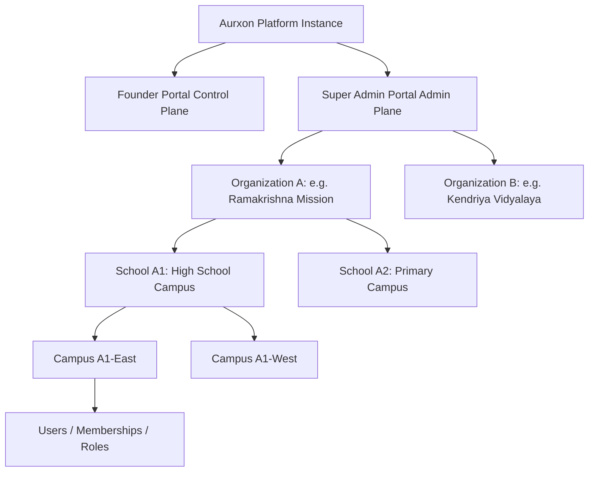
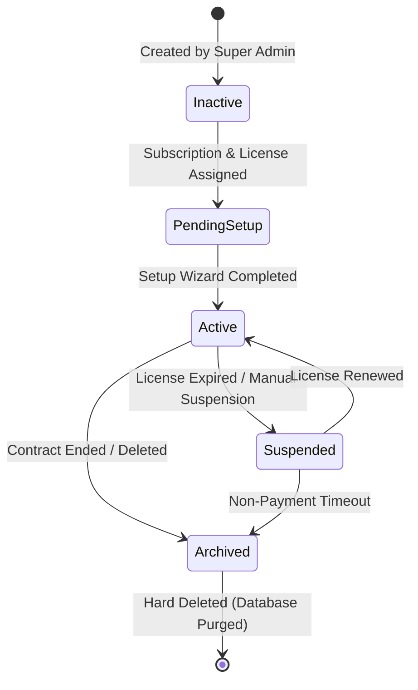

# Aurxon School ERP - Product Architecture Specification

## 1. Product Vision & Value Proposition

### 1.1 Centralized SaaS Platform Strategy
The Aurxon School ERP Platform is designed as a centralized, multi-tenant Software-as-a-Service (SaaS) educational operating system. Instead of deploying isolated server environments for every educational institute, Aurxon implements a **Single-Deployment, Multi-Tenant Engine**. 
- **Platform Provider View**: A single application instance, single database cluster, and unified domain router run the entire system.
- **Tenant Experience**: Each customer (Educational Trust or independent school) perceives a completely white-labeled, branded, high-performance portal isolated at the data, routing, and access control layers.

### 1.2 SaaS Scalability Focus
The platform shifts administrative complexity from hardcoded custom deployments to dynamic database-driven configurations:
- **Global Deployment Consolidation**: Deploy updates once to update all organizations instantly.
- **Tenant White-Labeling**: Customize login themes, DNS routing, logos, terms, and policies dynamically based on HTTP header context mapping.
- **Dynamic Module Activation**: Toggle features, limits, and modules at the tenant level via commercial subscriptions, instantly adapting the client UI and API routes.

---

## 2. Multi-Tiered Tenancy Structure

Aurxon structures its data and operations hierarchically to match trust groups and multi-campus institutes.

### 2.1 Domain Hierarchies
1. **Aurxon Platform**: The global hosting container (Next.js client + NestJS gateway API).
2. **Aurxon Founder / Super Admin**: Platform owners managing registrations, monitoring system metrics, and auditing tenant support actions.
3. **Organization (Tenant)**: The billing and primary legal entity (e.g. an Educational Trust managing multiple schools). Controls its own domains, subscription, and custom role parameters.
4. **School**: An academic entity within the organization (e.g. "Delhi Public School, Sector 4"). Has distinct academic templates and fee accounts.
5. **Campus**: A physical location of a school (e.g. "Primary Wing Campus" vs. "Senior Wing Campus"). Tracks biometric attendance sync and stock inventories.
6. **User & Memberships**: Individual identities that map to one or more organizations/schools with varying roles and context scopes.

---

## 3. Organization Lifecycle State Engine

Each organization registered on the platform traverses a set of validated states:

### 3.1 State Definitions
- **Inactive**: The organization profile is created, but no modules are assigned and credentials are not yet validated.
- **Pending Setup**: Subscription, license, and module selections are assigned. The onboarding wizard is active for the Organization Owner.
- **Active**: The onboarding wizard is completed. Academic session is initialized, and user portals are fully operational.
- **Suspended**: Access is revoked due to billing arrears or manual Super Admin action. Active sessions are terminated immediately.
- **Archived**: Read-only historical data archive. No mutations are allowed. Mapped to PostgreSQL tables that exclude indices from active lookup queries.
