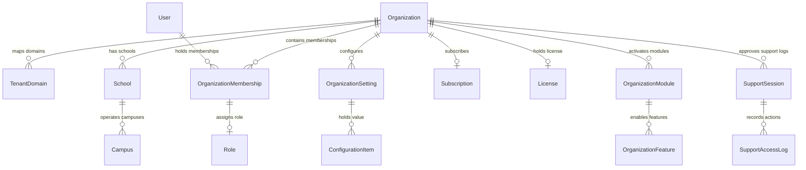

# Aurxon School ERP - Database Architecture Specification

## 1. Tenancy Schema Topography

To host multiple independent organizations on a unified cloud backend, the database implements a **Logical Multi-Tenancy Design** using a shared PostgreSQL database cluster. For premium organizations requiring strict regulatory boundaries, the connection routing layer switches destination targets to isolated PostgreSQL schemas.

### 1.1 Row-Level Security (RLS) Implementation
PostgreSQL Row-Level Security ensures that tenant isolation is enforced at the database level rather than relying solely on API controllers:
1. **Tenant Identification**: Every tenant-owned table inherits an `organization_id` column.
2. **Context Passing**: When the API server checks out a client request connection, it starts a transaction block and injects the active tenant context:
   ```sql
   SET LOCAL app.current_organization_id = 'organization-uuid-value';
   ```
3. **Security Policy Definition**: Security policies automatically evaluate rows at database execution runtime:
   ```sql
   CREATE POLICY tenant_isolation_policy ON "OrganizationMembership"
   FOR ALL
   USING (organization_id = current_setting('app.current_organization_id'));

   ALTER TABLE "OrganizationMembership" ENABLE ROW LEVEL SECURITY;
   ALTER TABLE "OrganizationMembership" FORCE ROW LEVEL SECURITY;
   ```
4. **Bypass Configurations**: Auditing and billing metrics tasks run via a distinct administrative connection string that bypasses RLS policies to perform cross-tenant analytics.

---

## 2. Multi-Tenant Relational ER Model



---

## 3. Database Scaling & Connection Routing

To scale traffic without exhausting resources, the database layer integrates:
- **PgBouncer Connection Pooler**: Sits between NestJS and PostgreSQL. Operates in Transaction Mode to recycle database connections instantly, supporting up to 10,000 active client connections.
- **Read-Write Splitting**: Writes target the PostgreSQL Primary instance. All reporting, audit logs queries, and list fetches target one or more read replicas asynchronously, minimizing primary read lock contention.
- **Dynamic Database Routing**: The connection factory maps incoming subdomains to tenant configurations. If a tenant operates on a dedicated database schema, the factory returns that schema pool connection string.

---

## 4. Performance Indexing & Range Partitioning

### 4.1 Indexing Strategy
To optimize index scans under massive multi-tenant database volumes:
1. **Tenant Lookup Index**: Compound indexing ensures quick query resolution:
   ```sql
   CREATE INDEX idx_membership_tenant_user ON "OrganizationMembership" (organization_id, user_id, status);
   ```
2. **Text Prefix Lookups**: Indexing for fast search inputs:
   ```sql
   CREATE INDEX idx_user_search ON "User" (lower(email), is_active);
   ```
3. **Audit Tracking Index**: Optimizes the dynamic fetch logs:
   ```sql
   CREATE INDEX idx_audit_logs_lookup ON "AuditLog" (organization_id, actor_id, created_at DESC);
   ```

### 4.2 range Partitioning on Transaction Logs
Tables that experience heavy write frequencies (`AuditLog`, `SecurityEventLog`, `SupportAccessLog`) are range-partitioned based on time metrics:
```sql
-- Partition Master Table Creation
CREATE TABLE "AuditLog_Partitioned" (
    id UUID NOT NULL,
    organization_id UUID NOT NULL,
    actor_id UUID NOT NULL,
    action VARCHAR(100) NOT NULL,
    details TEXT,
    created_at TIMESTAMP WITH TIME ZONE DEFAULT CURRENT_TIMESTAMP,
    PRIMARY KEY (id, created_at)
) PARTITION BY RANGE (created_at);

-- Partition Mappings
CREATE TABLE audit_log_y2026m06 PARTITION OF "AuditLog_Partitioned"
    FOR VALUES FROM ('2026-06-01 00:00:00+00') TO ('2026-07-01 00:00:00+00');
```
