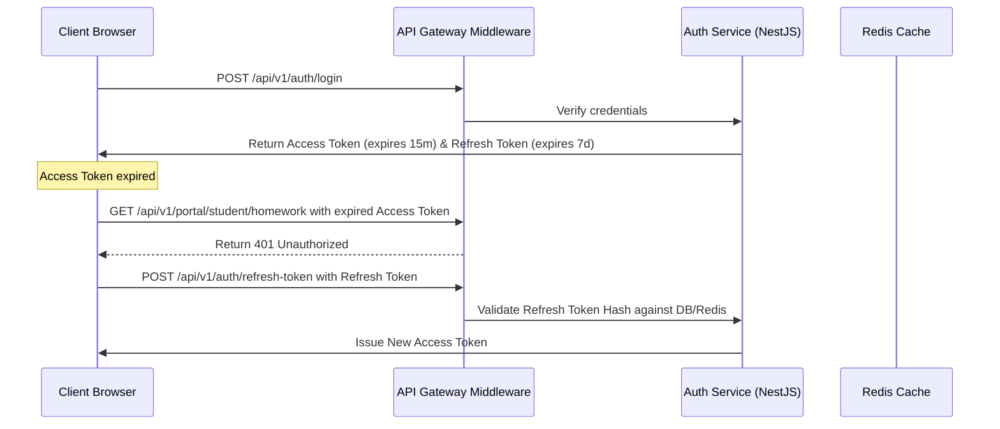
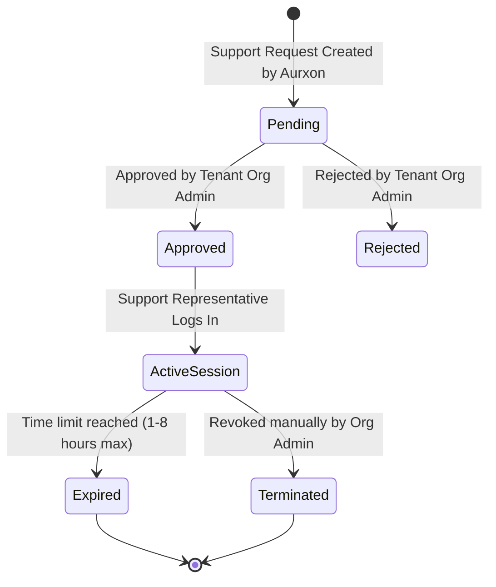

# Aurxon School ERP - Security & Privacy Specification

## 1. Token Lifecycles & Authenticated States

Security is maintained via cryptographic, state-bound tokens.



### 1.1 Token Cryptographic Structure
- **Access Tokens**: Short-lived (15 minutes). Decoded stateless tokens containing user UUID, active context mappings (organization, school, roles), and permission sets.
- **Refresh Tokens**: Long-lived (7 days). Stored in the database as a SHA-256 hash. Used to request a new access token without re-entering credentials.
- **Token Invalidation**: When a user logs out, switches passwords, or their membership status changes, their active session UUID is blacklisted in **Redis** for the remainder of the token duration.

---

## 2. Dynamic Tenant Isolation Guards

Isolation verification is implemented via custom NestJS Guards mapping parameters before they trigger business logics:
1. **Dynamic Context Guard**: Resolves context variables and checks that resource requests do not bypass active user tenant settings.
2. **Controller Request Pipeline**:
   ```text
   HTTP Request -> JWT Guard -> Context Guard -> RBAC Guard -> Module Active Guard -> Controller Action
   ```

---

## 3. Time-Bound Support Access Engine (Privacy Control)

To comply with enterprise student privacy norms, Aurxon platform administrators cannot view or edit student metrics, medical data, or ledger transactions directly. If debugging is necessary, access is granted temporarily under a cryptographic workflow.

### 3.1 Support Session State Workflow


### 3.2 Security Rules for Support Access
- **No Global DB Credentials**: Aurxon representatives have zero read access to organization schemas by default.
- **Support Request Validation**: Support tickets are initialized with a specific reason. The Organization Admin approves a strict, time-bound window (e.g. 2 hours).
- **Temporal Access Key Generation**: An authorization token is generated, signed with a secret containing the approved session scope.
- **Support Audit Trails**: Every database query executed using a support token is intercepted by database middlewares and written to `SupportAccessLog`, mapping:
  - Rep ID
  - Target Organization ID
  - SQL query executed / API endpoint called
  - Old values and new values (for write operations)
- **Automatic Expiry**: Database connection middleware checks the expiration timestamp. If the expiration passes, the token self-destructs, terminating active WebSocket connections immediately.
