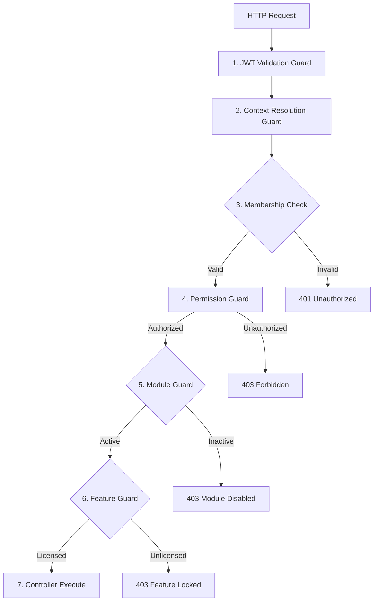

# Aurxon School ERP - Context Engine & RBAC Specification

## 1. Context Resolution Request Flow

To enforce tenant boundaries, RBAC, active module states, and feature licensing status simultaneously, every incoming API request must flow through a structured validation sequence:



### 1.1 Resolution Sequence Steps
1. **JWT Validation Guard**: Verifies the signature of the Authorization Bearer token.
2. **Context Resolution Guard**: Resolves the user identity, checks the active organization ID requested in the headers, and queries cached session contexts from Redis.
3. **Membership Check**: Confirms the user holds an active membership record in that organization, school, or campus.
4. **Permission Guard**: Compares requested resource action rules against the user's role permission set.
5. **Module Guard**: Assures the parent module of the endpoint is active on the organization's subscription portal.
6. **Feature Guard**: Confirms granular feature licensing limits (e.g. biometric attendance allowed).
7. **Controller Execute**: Hands context to the business service logic with tenant contexts pre-assigned.

---

## 2. Core Current Context Object (TypeScript)

The resolved request context is held in memory for the duration of the execution flow:

```typescript
// src/common/interfaces/current-context.interface.ts

export interface CurrentContext {
  /** Global authenticated User UUID */
  userId: string;

  /** Active Organization (Tenant) UUID */
  organizationId: string;

  /** Target School UUID (Optional depending on access depth) */
  schoolId?: string;

  /** Target Campus UUID (Optional depending on access depth) */
  campusId?: string;

  /** Array of active membership role IDs */
  roleIds: string[];

  /** Flattened list of permission identifiers (e.g. ["student:profile:create", "finance:ledger:read"]) */
  permissions: string[];

  /** List of active module codes for this organization */
  enabledModules: string[];

  /** List of active feature flag codes */
  enabledFeatures: string[];

  /** Current subscription tier (STARTER, PROFESSIONAL, ENTERPRISE) */
  subscriptionPlan: string;

  /** Expiration status of active license key (ACTIVE, EXPIRED) */
  licenseStatus: string;
}
```

---

## 3. NestJS Guard Decorators & Implementation Patterns

Guards intercept routing pipelines and evaluate security logic before request routing:

### 3.1 Required Organization Guard (`@RequireOrganization()`)
Verifies that the client has selected an active organization context and passes tenant validation:
```typescript
import { Injectable, CanActivate, ExecutionContext, UnauthorizedException } from '@nestjs/common';

@Injectable()
export class OrganizationGuard implements CanActivate {
  async canActivate(context: ExecutionContext): Promise<boolean> {
    const request = context.switchToHttp().getRequest();
    const organizationId = request.headers['x-tenant-id'];

    if (!organizationId) {
      throw new UnauthorizedException('Tenant context identifier missing (X-Tenant-ID header required)');
    }

    // Verify membership association
    const hasMembership = request.user.memberships.some(
      (m) => m.organizationId === organizationId && m.status === 'ACTIVE'
    );

    if (!hasMembership) {
      throw new UnauthorizedException('Invalid tenant context authorization for this resource');
    }

    request.currentTenantId = organizationId;
    return true;
  }
}
```

### 3.2 Required Permission Guard (`@RequirePermission()`)
Verifies authorization against resource scopes:
```typescript
// Usage Example: @RequirePermission('student:profile', 'CREATE')
import { SetMetadata, UseGuards, applyDecorators } from '@nestjs/common';

export const REQUIRE_PERMISSION_KEY = 'require_permission';
export const RequirePermission = (resource: string, action: string) => 
  applyDecorators(
    SetMetadata(REQUIRE_PERMISSION_KEY, { resource, action }),
    UseGuards(PermissionGuard)
  );
```

### 3.3 Required Module Guard (`@RequireModule()`)
Asserts module state activation on tenant profiles:
```typescript
// Usage Example: @RequireModule('STUDENT_MANAGEMENT')
export const REQUIRE_MODULE_KEY = 'require_module';
export const RequireModule = (moduleCode: string) =>
  applyDecorators(
    SetMetadata(REQUIRE_MODULE_KEY, moduleCode),
    UseGuards(ModuleActiveGuard)
  );
```

### 3.4 Required Feature Guard (`@RequireFeature()`)
Locks premium items:
```typescript
// Usage Example: @RequireFeature('BIOMETRIC_ATTENDANCE')
export const REQUIRE_FEATURE_KEY = 'require_feature';
export const RequireFeature = (featureCode: string) =>
  applyDecorators(
    SetMetadata(REQUIRE_FEATURE_KEY, featureCode),
    UseGuards(FeatureActiveGuard)
  );
```
These guards query cached settings dynamically, enabling instant access updates when settings are altered in the marketplaces.
