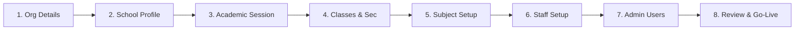

# Aurxon School ERP - Setup Wizard Specification

## 1. Onboarding & First-Time Activation Workflow

When a new organization is onboarded, its registration status remains `PENDING_SETUP`. The Organization Owner must complete the 8-Step Setup Wizard to initialize the tenant database and activate the portal.

---

## 2. Onboarding Steps Breakdown

### 2.1 Step 1: Organization Information
- **UI Form Inputs**: Legal Trust Name, Registration Code, Corporate Billing Address, Domain Preference (`rkmvp.aurxon.com` or custom domain `portal.rkmvp.edu`), Primary Contact Phone, Primary Contact Email.
- **System Action**: Writes records to `Organization` and `TenantDomain`. Sets `sslStatus = PENDING` for routing validations.

### 2.2 Step 2: School Profile
- **UI Form Inputs**: School Name (e.g. "Ramakrishna Mission High School"), Board Affiliation (Select: CBSE, ICSE, Cambridge, IB, State Board), Contact details, School Logo file upload.
- **System Action**: Creates `School` table record. Generates initial `OrganizationBranding` record with primary colors based on the uploaded logo's color theme palette.

### 2.3 Step 3: Academic Session
- **UI Form Inputs**: Active Session Name (e.g. "2026-2027"), Start Date (Select: `2026-04-01`), End Date (Select: `2027-03-31`), Active grading rules template.
- **System Action**: Creates `AcademicYear` table record. Generates `OrganizationSetting` templates matching the selected Board affiliation rules from Step 2.

### 2.4 Step 4: Classes & Sections
- **UI Grid Mappings**: Define grades (e.g. Nursery, KG, Grade 1 to 10) and associate section labels (e.g. "A", "B", "C").
- **System Action**: Bulk-inserts `Class` records linked to the target School.

### 2.5 Step 5: Subjects Configuration
- **UI Grid Mappings**: Define subject catalog lists per grade. Mapping core requirements (English, Mathematics, Science) and electives.
- **System Action**: Bulk-inserts `Subject` records mapping their respective `classId` keys.

### 2.6 Step 6: Staff Registry
- **UI File Import / Grid**: Excel/CSV template download and upload containing Initial Staff Roster (Designation, Email, Phone, Salary bracket, Department).
- **System Action**: Validates CSV schemas and inserts pending `Staff` records. Sends signup invitation notification templates dynamically.

### 2.7 Step 7: Administrator User Accounts
- **UI Form Inputs**: Register initial School Admin and Principal user profiles.
- **System Action**: Generates `User` records with password hashes, maps memberships in `OrganizationMembership`, and assigns roles. Generates MFA activation QR codes.

### 2.8 Step 8: Review & Go-Live Check
- **System Integrity Check**: Verifies that:
  - At least one School and one active Campus are configured.
  - Active Academic Session is mapped.
  - At least one Administrator account holds login credentials.
- **User Action**: Owner signs the system terms agreement.
- **Final Transition**: Patches `Organization.status` to `ACTIVE`. Automatically registers a domain event `setup.completed` and emits notification dispatches to platform owners.
