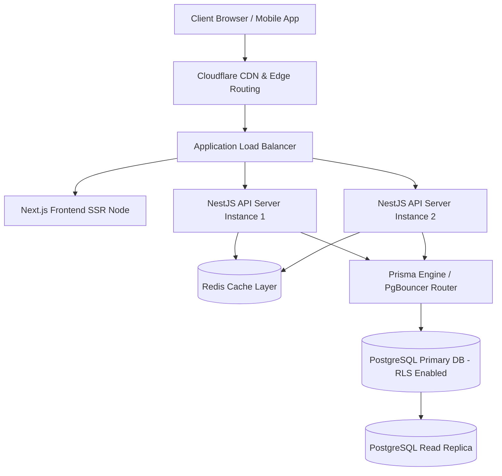
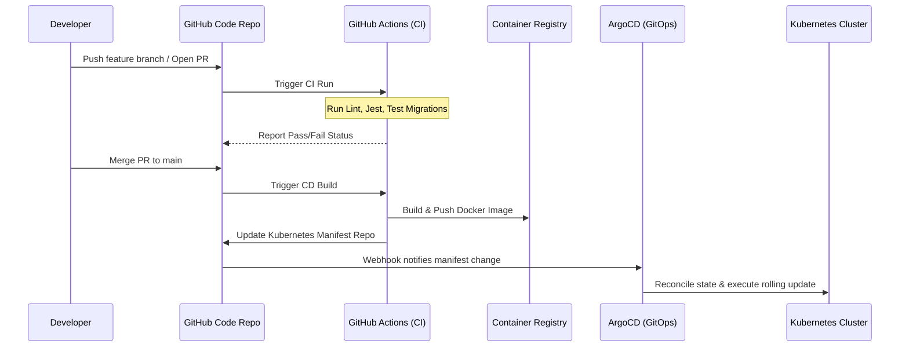
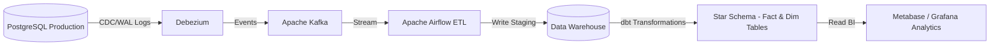

# Enterprise School ERP - Product Requirement Document & Solution Architecture Document (SAD)

## 1. Executive Summary & Business Objectives

### 1.1 Platform Mission
The AURXON ERP Enterprise Ecosystem is designed as a SaaS-native, multi-tenant, and multi-campus School ERP platform. It is engineered to govern the entire administrative, academic, financial, compliance, and communication lifecycles of modern educational institutions. The platform scales dynamically from single-campus nurseries to massive, multi-city educational trusts managing hundreds of schools under diverse national and international boards (CBSE, ICSE, State Boards, and Custom Boards).

### 1.2 Business Goals
- **Global Tenancy Consolidation**: Provide educational trusts with a unified control plane to manage multiple campuses, consolidate financials, and enforce standardized academic policies.
- **Compliance Automation**: Automate state and national government compliance reports including UDISE+, Samagra ID, APAAR ID (Academic Bank of Credits), and Right to Education (RTE) reimbursement auditing.
- **Financial Integrity**: Secure fee collection processes and payroll management with a zero-leakage, double-entry ledger-backed engine.
- **Decentralized Operation**: Enable strict role-based operations with clear escalation, delegation, and acting authority pathways.

---

## 2. Functional Requirement Specification (FRS)

### 2.1 Student Lifecycle Management
- **Inquiry & Lead Capture**: Digital inquiry intake, source tracking, counselor allocation, and conversion tracking.
- **Admission Workflows**: Document upload, Aadhaar matching, EWS/RTE criteria verification, fee concession assignments, and unique Scholar Number generation.
- **Enrollment**: Automated class-section allocation, roll number generation, and profile initialization (Medical records, sibling link, guardian profiles).
- **Promotion & Progression**: Year-end promotion engine with grade thresholds, student transfer certificates (TC), migration tracking, and graduation registry.
- **Alumni Network**: Archive records upon graduation, mapping historical academic details while providing access to alumni communication feeds.

### 2.2 Academic Structure & Curriculum
- **Hierarchy Configuration**: Standardizing Academic Sessions, terms, streams (Science - PCM/PCB, Commerce, Humanities, Custom stream configurations), classes, and sections.
- **Subject Mapping**: Core, elective, activity-based, practical, and co-scholastic subjects mapped to teachers with specific class load definitions.
- **Syllabus Tracker**: Digital lesson planning, teacher progress mapping against academic schedules, and coordinator approval workflows.

### 2.3 Attendance System
- **Student Attendance**: Daily, subject-wise, or period-wise recording via teacher portal, parent alerts for absentees, and monthly defaulter analytics.
- **Staff Attendance**: Biometric sync, support for device webhooks (real-time transaction log push) or REST API polling, manual correction workflows, and leave linkage.

### 2.4 Examination Engine & Configurable Grade Books
- **Assessment Configurator**: Support for Unit Tests, Monthly Tests, Mid-Terms, Practicals, Projects, Vivas, and Final Exams.
- **Formula Result Engine**: Configurable grade and mark weightage calculations at the class or board level:
  $$\text{Final Result} = (\text{UT} \times 0.20) + (\text{HalfYearly} \times 0.30) + (\text{Annual} \times 0.50)$$
- **CBSE/ICSE Grading Standards**: Grade conversion tables, grade point average (GPA) calculations, and rank determinations.

### 2.5 Accounts & Finance
- **Fee Configuration**: Fee heads (Tuition, Development, Library, Transport, Lab), multi-installment templates, late fees, sibling discount concessions, and RTE adjustments.
- **Collection & Ledger Engine**: Integrated payment gateway settlements (UPI, Cards, Net Banking) and offline collection (Cash/Cheque clearance workflows). Every transaction generates an immutable receipt linked to a double-entry general ledger.
- **Staff Payroll**: Dynamic payroll registers calculating Earnings (Basic, HRA, DA, Allowances) and statutory Deductions (Provident Fund, ESI, Professional Tax, Loan recoveries).
- **Accounting & Ledger**: Chart of Accounts, manual journal entries, cash books, bank reconciliation, trial balance, and profit & loss generators.

### 2.6 Inventory & Asset Management
- **Procurement & Vendors**: Vendor registry, purchase orders, purchase history, and contract storage.
- **Asset Lifecycle**: Computer labs, books, science equipment, and furniture tracking. Automated straight-line depreciation calculations.

### 2.7 Communication System
- **Omnichannel Alerts**: Central circulars, homework postings, fee reminders, and emergency alerts routed through SMS, Email, WhatsApp, and Mobile Push Notifications.
- **Delivery Audits**: Track read and delivery status of critical alerts (e.g., fee overdue, extreme weather cancellations).

---

## 3. Non-Functional Requirement Specification (NFR)

| Metric | Target | Verification Method |
| :--- | :--- | :--- |
| **Lighthouse Performance** | $\ge 95$ | Automated Lighthouse CLI audits in CI/CD pipeline |
| **Accessibility (WCAG)** | WCAG 2.1 Level AA compliant | Axe-Core accessibility scanner tests |
| **API Response Time** | P95 < 200ms for read endpoints | Load testing via K6 (10,000 concurrent virtual users) |
| **Multi-Tenant Isolation** | Database logic partition (RLS) | Security penetration audits and unit testing |
| **RPO (Recovery Point)** | $\le 1$ hour | Database transaction log archiving schedules |
| **RTO (Recovery Time)** | $\le 4$ hours | Simulated disaster recovery drill execution |

---

## 4. System & Multi-Tenant Architecture

### 4.1 Tenancy Isolation Model
The platform adopts a **Logical Multi-Tenancy Architecture** with a shared database schema. Tenant separation is enforced at the database layer via PostgreSQL **Row Level Security (RLS)**. Every table features a `tenant_id` column, representing the primary Institution.
- For high-enterprise trust groups, the system supports dynamic routing to dedicated PostgreSQL schemas or physical databases based on the tenant API key or subdomain mapping (`tenant1.aurxon.com`).



---

## 5. Cloud Topography Deployments (AWS, Azure, GCP)

### 5.1 AWS Deployment Architecture
- **DNS & CDN**: Route 53 routes requests to Cloudfront with Web Application Firewall (WAF) enabled.
- **Compute**: AWS Elastic Kubernetes Service (EKS) hosting NestJS containers. Scaling policies triggered at 70% CPU/Memory usage.
- **Database**: Amazon RDS for PostgreSQL in Multi-AZ configuration. Primary node handles writes; read replicas handle reporting and analytics queries.
- **Caching**: Amazon ElastiCache for Redis (Cluster Mode enabled).
- **Object Storage**: Amazon S3 with SSE-S3 encryption for TCs, Marksheets, and admission document assets.

### 5.2 Azure Deployment Architecture
- **DNS & CDN**: Azure DNS and Azure Front Door with Web Application Firewall.
- **Compute**: Azure Kubernetes Service (AKS) orchestrating Docker containers.
- **Database**: Azure Database for PostgreSQL Flexible Server with High Availability enabled.
- **Caching**: Azure Cache for Redis.
- **Object Storage**: Azure Blob Storage (LRS/GRS configured) storing student documents.

### 5.3 GCP Deployment Architecture
- **DNS & CDN**: Google Cloud DNS and Cloud CDN with Cloud Armor protection.
- **Compute**: Google Kubernetes Engine (GKE) running API pods.
- **Database**: Cloud SQL for PostgreSQL with high-availability regional configurations.
- **Caching**: Google Cloud Memorystore for Redis.
- **Object Storage**: Google Cloud Storage buckets.

---

## 6. DevOps & CI/CD Blueprint

### 6.1 Git Branching Strategy
We implement a modified **GitFlow** branching strategy:
- `main`: Production-ready releases. Direct pushes are blocked.
- `release/*`: Stabilization branches preparing for deployment.
- `develop`: Integration branch for new features.
- `feature/*`: Short-lived branches containing individual user stories.

### 6.2 CI/CD Lifecycle (GitHub Actions & ArgoCD)
- **Continuous Integration (CI)**: On every Pull Request to `develop`, Github Actions runs:
  1. Linter (`eslint`) and Prettier formatting checks.
  2. Database migration validation dry-runs against a test database.
  3. Unit and integration tests (`jest`).
  4. Docker build checks to ensure container compilation integrity.
- **Continuous Deployment (CD)**: On merge to `main`:
  1. Build and push Docker image tag to Amazon ECR/Azure Container Registry.
  2. Update Kubernetes manifests in the GitOps configuration repository.
  3. ArgoCD detects configuration changes and automatically synchronizes the new state with the target EKS/AKS cluster.



### 6.3 Monitoring, Logging & Alerting
- **Metrics**: Prometheus pulls CPU, Memory, network traffic, and HTTP request metrics from NestJS pods.
- **Dashboards**: Grafana visualizes NestJS cluster loads, active connections, and database query durations.
- **Log Aggregation**: Fluentd collects stdout/stderr logs from all pods and sends them to Elasticsearch/Loki.
- **Error Tracking**: Sentry SDK is integrated into both NestJS and Next.js, capturing uncaught exceptions with full stack traces.

---

## 7. Analytics & BI Data Warehouse Architecture

To prevent reporting queries from locking database tables in production, we design a separate analytics pipeline.

### 7.1 ETL Pipeline & Schema Topography
- **Change Data Capture (CDC)**: Debezium reads PostgreSQL transaction logs (`WAL`) and writes updates to an Apache Kafka broker.
- **ETL Coordinator**: Apache Airflow schedules daily ETL jobs.
- **Transformation Engine**: dbt (data build tool) reads raw CDC records from a staging area and aggregates them into Star/Snowflake schemas inside the **Data Warehouse** (Amazon Redshift, Google BigQuery, or a dedicated PostgreSQL analytics instance).



### 7.2 Analytics Star Schema Design
```text
FactStudentPerformance
  ├── id (PK)
  ├── student_key (FK -> DimStudent)
  ├── academic_year_key (FK -> DimAcademicYear)
  ├── subject_key (FK -> DimSubject)
  ├── total_marks_obtained
  ├── theory_marks
  ├── practical_marks
  ├── percentage
  └── pass_fail_status

DimStudent
  ├── student_key (PK)
  ├── scholar_number
  ├── gender
  ├── category (OBC, SC, ST, GENERAL)
  ├── rte_status
  └── state
```

---

## 8. Disaster Recovery (DR) Plan

### 8.1 Backup Strategy
- **Database Backups**: Hourly WAL (Write-Ahead Log) archiving to Amazon S3 with point-in-time recovery (PITR) up to 35 days. Daily full snapshot backups, retained for 1 year.
- **Cross-Region Replication**: Object storage assets (S3 buckets containing TCs, certificates, receipts) and database snapshots are replicated cross-region asynchronously.

### 8.2 Recovery Procedures
1. **Infrastructure Provisioning**: In the event of primary region failure, Terraform schedules infrastructure provisioning in the secondary disaster recovery region.
2. **Database Restore**: Recover PostgreSQL from the latest hourly snapshot, applying PITR WAL records up to the point of failure.
3. **DNS Failover**: Route 53 health check thresholds trigger automatic DNS redirection to the secondary region Load Balancer.

---

## 9. Implementation Roadmap & Development Plan

### 9.1 Phase-wise Sprint Plan

```text
├── Phase 1: Core ERP Foundations (Sprints 1-4)
│   ├── Tenant registration & RBAC permissions setup
│   ├── Student Admission & Staff profiles
│   └── Multi-campus academic structures
│
├── Phase 2: Financials & Examinations (Sprints 5-8)
│   ├── Configurable Fee Structure & PG integration
│   ├── Exam assessment scheduler & Result formula calculations
│   └── Double-entry general ledger & payroll automation
│
├── Phase 3: Communication & Document Archiving (Sprints 9-12)
│   ├── Omnichannel communication alerts (SMS, Email, WhatsApp)
│   ├── Document template engine (Transfer Certificate, Marksheet PDFs)
│   └── Biometric attendance integration via webhooks
│
└── Phase 4: Data Warehouse & Advanced BI (Sprints 13-16)
    ├── ETL pipelines setup with dbt & Airflow
    ├── Predictive dropout alerts & financial trend dashboards
    └── Platform scale testing & performance tuning
```

### 9.2 Team Structure
- **1 Principal Architect**: System design, database constraints, code standards, security patterns.
- **2 Backend Developers**: NestJS services, Prisma migrations, API controllers, worker tasks.
- **2 Frontend Developers**: Next.js views, Tailwind CSS styling, state context, responsive layout validation.
- **1 DevOps Engineer**: K8s deployments, GitHub Actions CI/CD workflows, monitoring pipelines, backup scripting.
- **1 QA Engineer**: Automated integration testing (Playwright), API performance verification (K6), security penetration check.

### 9.3 Cost Estimation Framework
- **Infrastructure Cost**: Compute (K8s worker nodes), Caching (Redis), Storage (S3/PostgreSQL DB sizes), CDN traffic bandwidth, and Third-Party integration costs (SMS/WhatsApp gateway bills). Calculated per 1,000 active concurrent users.
- **Tenant Licensing**: Pricing tiers based on total enrolled student headcounts per billing cycle.
