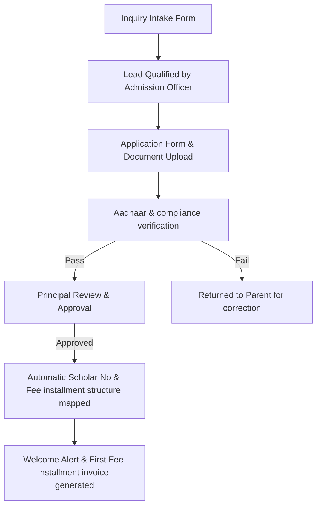
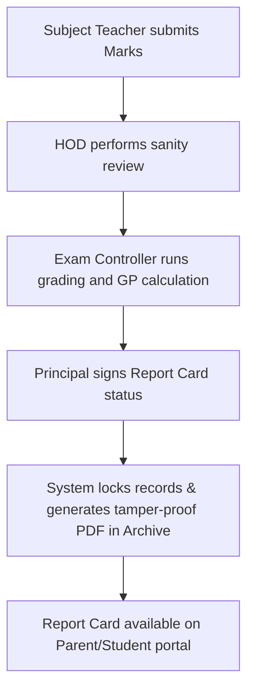
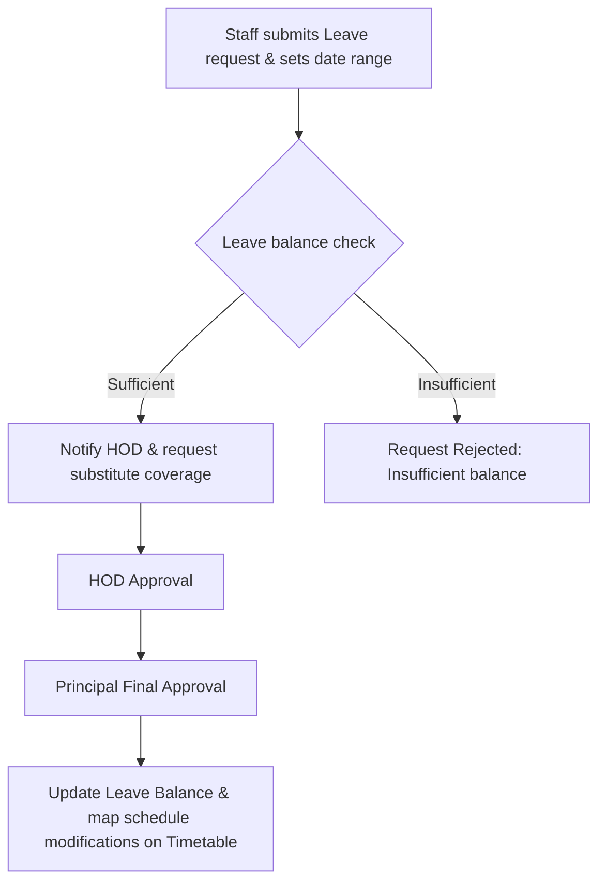

# Enterprise School ERP - Roles, Workflows, & UI/UX Specification

## 1. Granular Role-Based Access Control (RBAC) Matrix

The system maps authorization permissions across **21 distinct user roles**. Permissions are categorized as:
- **C**: Create
- **R**: Read
- **U**: Update
- **D**: Delete
- **A**: Approve / Sign

| User Role | Admissions | Academics | Attendance | Exams & Marks | Fee Collection | General Ledger | Staff HR | Library | Settings |
| :--- | :---: | :---: | :---: | :---: | :---: | :---: | :---: | :---: | :---: |
| **Super Admin** | CRUD | CRUD | CRUD | CRUD | CRUD | CRUD | CRUD | CRUD | CRUDA |
| **Platform Admin** | CRUD | R | R | R | R | R | R | R | CRUDA |
| **School Owner** | R | R | R | R | R | R | R | R | CR |
| **Trust Management** | R | R | R | R | R | R | R | R | R |
| **Chairman** | R | R | R | R | R | R | R | R | R |
| **Director** | R | R | R | R | R | R | R | R | R |
| **Principal** | RA | CRUA | CRUA | CRUA | R | R | CRUA | CR | CRUA |
| **Vice Principal** | RA | CRUA | CRUA | CRUA | R | R | CRUA | CR | CR |
| **Academic Coord.** | R | CRUA | RU | CRUA | - | - | R | R | - |
| **HOD** | R | RU | RU | RUA | - | - | RU | R | - |
| **HR Manager** | - | - | R | - | - | RU | CRUDA | R | R |
| **Finance Manager** | - | - | - | - | CRUA | CRUDA | R | - | R |
| **Accountant** | - | - | - | - | CRU | RU | R | - | - |
| **Admission Officer** | CRU | R | - | - | R | - | - | - | - |
| **Front Desk** | R | - | R | - | R | - | - | R | - |
| **Exam Controller** | - | R | - | CRUDA | - | - | - | - | - |
| **Librarian** | - | - | - | - | - | - | - | CRUD | - |
| **Class Teacher** | R | RU | CRU | RUA | - | - | - | R | - |
| **Subject Teacher** | - | R | CRU | RU | - | - | - | R | - |
| **Parent** | R | R | R | R | RU | - | - | R | - |
| **Student** | - | R | R | R | R | - | - | R | - |

---

## 2. Configurable Organizational Hierarchy & Delegation Engine

To accommodate temporary absences and escalation chains, the hierarchy engine implements:
1. **Delegation Rules**: An officer (e.g. Principal) can delegate their approval signature to a subordinate (e.g. Vice Principal) for a scheduled duration.
   - The database records the delegate authority with an effective start and end timestamp.
   - Every action signed by a delegate logs the audit trails: `Signed by Vice Principal [User B] on behalf of Principal [User A]`.
2. **Escalation Timers**: If an approval step is stuck (e.g. a leave request sits pending in a HOD queue for more than 48 hours), the workflow engine automatically escalates the task to the next parent node (e.g. Principal) and notifies the parties.

---

## 3. Workflow Engine Diagrams

### 3.1 Admission Workflow


### 3.2 Fee Payment & Ledger Posting Workflow
```mermaid
graph TD
    Invoice[Fee Invoice generated automatically] --> ParentPay[Parent Pays via UPI/Card or Cash offline]
    ParentPay --> Gateway{Gateway Status?}
    Gateway -->|Success| LedgerPost[System registers Payment record]
    Gateway -->|Clearance Needed| Hold[Cheque clearance hold queue]
    LedgerPost --> DBEntry[Double Entry: DR Cash/Bank Account | CR Student Account Chart]
    LedgerPost --> Receipt[Generate PDF Receipt & update Student Allocation to PAID]
```

### 3.3 Exam Result & Marksheet Validation


### 3.4 Leave Approval Workflow


---

## 4. Dashboard Configurations

### 4.1 Principal Dashboard
- **KPI Metrics**: Total Enrolled Student headcount, Today's Student/Staff Attendance rates, Collected vs. Outstanding Fee amounts, Open Staff Leave requests, pending budget approvals.
- **Charts**: Academic grade curves (subject-wise), Fee collection monthly trends.
- **Quick Actions**: Add circular, approve pending leaves, sign report cards, audit logs viewer.

### 4.2 Class Teacher Dashboard
- **KPI Metrics**: Class attendance rate today, pending homework evaluations, student average grade indicators, behavioral incidents logged.
- **Widgets**: My Schedule Timetable, Circular notices feed, parent communication tickets.
- **Quick Actions**: Take attendance, submit UT marks, add behavior note.

---

## 5. UI/UX Wireframes (Glacier White & Navy Blue Tokens)

### 5.1 Main Portal Layout (Dashboard Framework)
```text
┌────────────────────────────────────────────────────────────────────────────────────────┐
│  [Logo] AURXON ERP Lite   |  Session: 2026-2027  |  Branch: Delhi  |  User: Principal  │
├───────────────┬────────────────────────────────────────────────────────────────────────┤
│ Side Nav      │ [ KPI: Enrolled ]  [ KPI: Fee Collection ]  [ KPI: Daily Attendance ]  │
│ ────────      │ [ 1,240 Students]  [ ₹4.2M / ₹5.0M Paid  ]  [ 96.4% Student Rate    ]  │
│ - Dashboard   ├────────────────────────────────────────────────────────────────────────┤
│ - Admissions  │ [ Widget: Pending Approvals ]                                          │
│ - Academics   │ ├─ Leave Request: Teacher A (Sick Leave, 2 days)  [Approve] [Reject]   │
│ - Attendance  │ ├─ Fee Concession: Scholar #1024 (RTE discount)   [Approve] [Reject]   │
│ - Examinations│ ├─ Report Cards: Grade 10 A Results Verification  [Sign-Off]           │
│ - Financials  ├────────────────────────────────────────────────────────────────────────┤
│ - HR/Payroll  │ [ Chart: Monthly Collection Progress ]                                  │
│ - Library     │   80% |██████████████████████████                                          │
│ - Settings    │   40% |████████████                                                        │
│               │    0% └──────────────────────────                                      │
│               │       Jan  Feb  Mar  Apr  May                                          │
└───────────────┴────────────────────────────────────────────────────────────────────────┘
```

### 5.2 Professional A4 Report Card Design Template (PDF Generation Model)
```text
┌────────────────────────────────────────────────────────────────────────────────────────┐
│                              MODERN PUBLIC SCHOOL, DELHI                               │
│                         Affiliated to CBSE | Session: 2026-2027                        │
│                                  ACADEMIC REPORT CARD                                  │
├────────────────────────────────────────────────────────────────────────────────────────┤
│ Student Name: Aarav Sharma               | Admission No: 2026-10204                    │
│ Class & Sec: Grade 10 Section A          | Roll Number: 14                             │
│ Father's Name: Mr. Rajesh Sharma        | Mother's Name: Mrs. Priya Sharma            │
├────────────────────────────────────────────────────────────────────────────────────────┤
│ Subject        │ Theory (80) │ Practical (20) │ Internal (10) │ Total (100) │ Grade    │
├────────────────┼─────────────┼────────────────┼───────────────┼─────────────┼──────────┤
│ Mathematics    │     72      │       18       │       9       │     99      │    A1    │
│ Science        │     68      │       19       │       9       │     96      │    A1    │
│ English        │     70      │       --       │      10       │     80      │    B1    │
│ Social Science │     65      │       --       │       9       │     74      │    B2    │
│ Hindi          │     73      │       --       │       8       │     81      │    B1    │
├────────────────┴─────────────┴────────────────┴───────────────┴─────────────┴──────────┤
│ Attendance: 194 / 200 Days (97.0%)     | Result Status: PROMOTED TO GRADE 11           │
├────────────────────────────────────────────────────────────────────────────────────────┤
│ Co-Scholastic Grades:                                                                  │
│ - Discipline: A+   | Behaviour: A      | Sports: A+   | Creativity: B+                 │
├────────────────────────────────────────────────────────────────────────────────────────┤
│ Class Teacher Remarks: Aarav shows exceptional performance in science and mathematics. │
│ Principal Remarks: Excellent work. Keep up the high academic standards.                │
├────────────────────────────────────────────────────────────────────────────────────────┤
│                                                                                        │
│     [Signature]                  [Signature]                      [Signature]          │
│    Class Teacher               Exam Controller                     Principal           │
└────────────────────────────────────────────────────────────────────────────────────────┘
```
